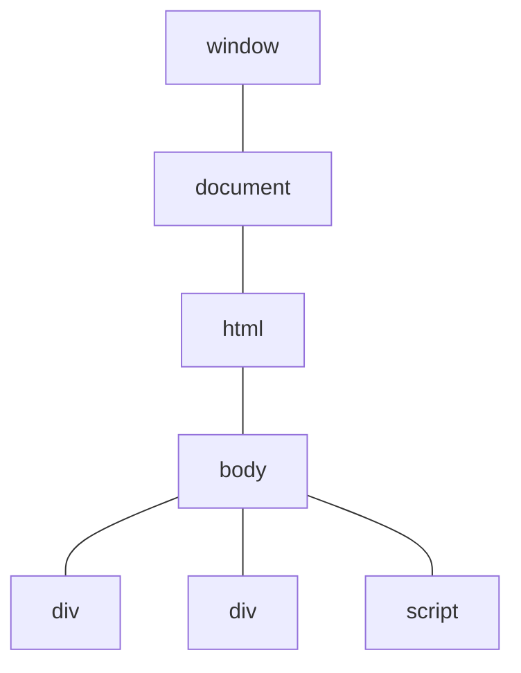

This project show i learn react

## Table of contents

- [Create app basis with react](#Create-app-basis-with-react)

-------------------------------------------------------------------------

## Create app basis with react

### Prerrequisites
For the project you need to install nodejs first, preferelly 14.18+, 16+

If has all installed then continue

```shell
npx create-react-app bitacora
```

```shell
npm i react-router-dom --save
```

### Delete all files at folders public and src
```shell

```


